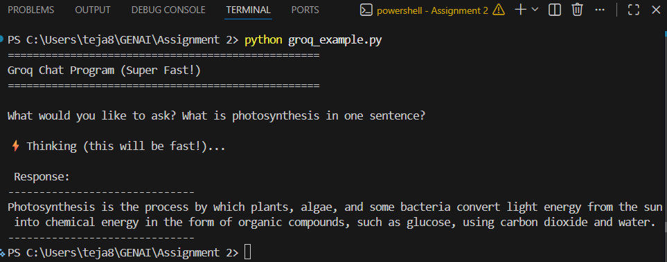
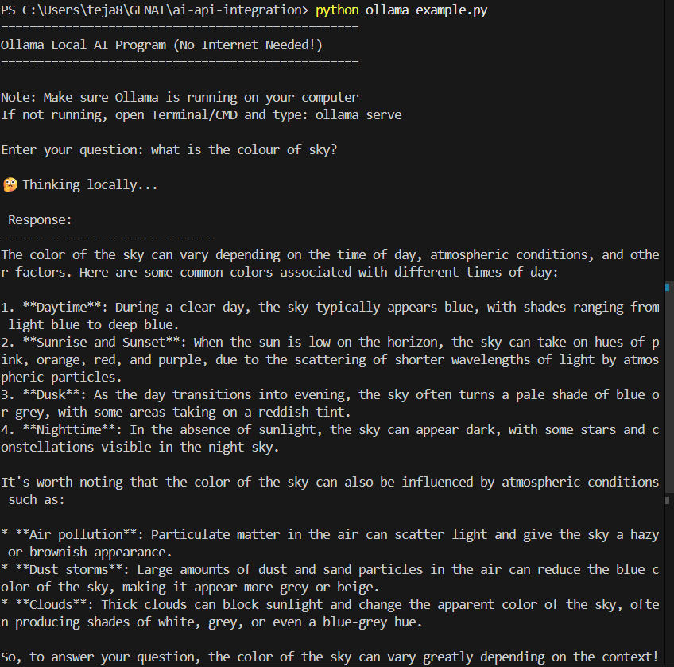
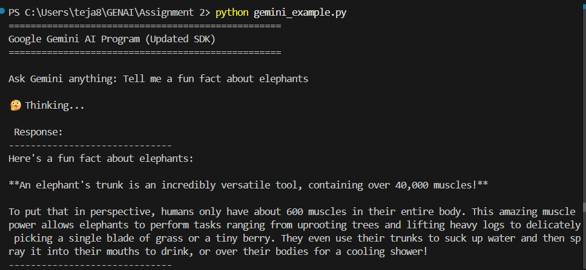
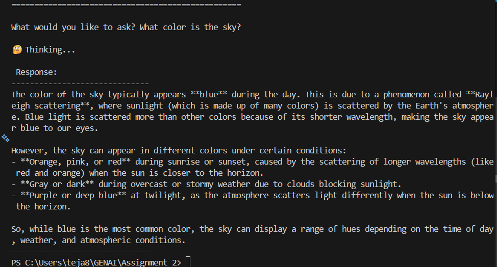

```markdown
# 🤖 GenAI API Integration Assignment

<div align="center">
  <h3>Six AI APIs - One Project</h3>
  <p>OpenAI | Groq | Ollama | Hugging Face | Google Gemini | Cohere</p>
</div>

## 📋 Project Description
This project demonstrates how to integrate and use six different AI providers through their APIs. Each program allows you to send prompts and receive responses from different AI models. Perfect for learning how to work with various AI services!

## 🚀 Quick Start Guide

### Prerequisites
- ✅ Python 3.8 or higher installed
- ✅ pip (Python package installer)
- ✅ Git (for GitHub)
- ✅ Internet connection (except for Ollama)

## 🔧 Setup Instructions

### Step 1: Clone or Create Project Folder
```bash
# Create project folder
mkdir ai-api-integration
cd ai-api-integration
```

### Step 2: Install Required Packages
```bash
# Install all dependencies at once
pip install -r requirements.txt

# Or install them one by one
pip install groq
pip install ollama
pip install transformers
pip install torch
pip install google-genai
pip install cohere
pip install python-dotenv
pip install requests
```

## 🔑 How to Get API Keys (With Screenshots)

### 1️⃣ **Groq API Key**
| Step | Instructions |
|------|--------------|
| 1 | Visit https://console.groq.com |
| 2 | Sign up with Google or email |
| 3 | Go to API Keys section |
| 4 | Click "Create API Key" |
| 5 | Give it a name and copy the key |

### 2️⃣ **Ollama (No API Key Needed!)**
| Step | Instructions |
|------|--------------|
| 1 | Download from https://ollama.ai/ |
| 2 | Install like any other program |
| 3 | Open Terminal/CMD and type: `ollama pull llama3.2` |
| 4 | Wait for download (about 2GB) |
| 5 | That's it! Runs completely free on your computer |

### 3️⃣ **Hugging Face API Key**
| Step | Instructions |
|------|--------------|
| 1 | Go to https://huggingface.co |
| 2 | Click "Sign Up" (top right) |
| 3 | Verify your email |
| 4 | Go to Settings → Access Tokens |
| 5 | Click "New token" → Name it → "Generate" |
| 6 | Copy the token (starts with `hf_`) |

### 4️⃣ **Google Gemini API Key**
| Step | Instructions |
|------|--------------|
| 1 | Visit https://makersuite.google.com/app/apikey |
| 2 | Sign in with your Google account |
| 3 | Click "Create API Key" |
| 4 | Select or create a project |
| 5 | Copy your new API key |

### 5️⃣ **Cohere API Key**
| Step | Instructions |
|------|--------------|
| 1 | Go to https://dashboard.cohere.com |
| 2 | Sign up with email or Google |
| 3 | Verify your email |
| 4 | Go to API Keys section |
| 5 | Copy your trial API key |

## 🔐 Setting Up Environment Variables (IMPORTANT!)

**Never put API keys directly in your code!**

### For Windows Users (Command Prompt)
```cmd
setx GROQ_API_KEY "your-groq-key-here"
setx HUGGINGFACE_API_KEY "your-huggingface-key-here"
setx GOOGLE_API_KEY "your-gemini-key-here"
setx COHERE_API_KEY "your-cohere-key-here"
```

### For Mac/Linux Users
```bash
export GROQ_API_KEY="your-groq-key-here"
export HUGGINGFACE_API_KEY="your-huggingface-key-here"
export GOOGLE_API_KEY="your-gemini-key-here"
export COHERE_API_KEY="your-cohere-key-here"
```

### Alternative: Using .env File (Easier!)
Create a file called `.env` in your project folder:
```env
GROQ_API_KEY=gsk_xxxxxxxxxxxx
HUGGINGFACE_API_KEY=hf_xxxxxxxxxxxx
GOOGLE_API_KEY=AIzaxxxxxxxxxxxx
COHERE_API_KEY=xxxxxxxxxxxx
```

**IMPORTANT:** Create a `.gitignore` file and add `.env` to it!

## 🎮 How to Run Each Program

### ▶️ Run Groq Example
```bash
python groq_example.py
```
**Sample Input:** `Tell me a fun fact about elephants`
**Expected Output:** `Elephants are the only mammals that can't jump!`

### ▶️ Run Ollama Example (Local)
```bash
# First, make sure Ollama is running
ollama serve

# In another terminal, run:
python ollama_example.py
```
**Sample Input:** `What is 2+2?`
**Expected Output:** `2+2 equals 4`

### ▶️ Run Hugging Face Example
```bash
python huggingface_example.py
```
**Sample Input:** `Say hello in Spanish`
**Expected Output:** `Hola`

### ▶️ Run Google Gemini Example
```bash
python gemini_example.py
```
**Sample Input:** `What color is the sky?`
**Expected Output:** `The sky appears blue during the day.`

### ▶️ Run Cohere Example
```bash
python cohere_example.py
```
**Sample Input:** `Name one planet`
**Expected Output:** `Jupiter`

## 📸 Screenshots

All working outputs are saved in the `screenshots/` folder:

Here are all my working programs:

## 📸 Screenshots

<div align="center">

### Groq


### Ollama


### Hugging Face


### Google Gemini


### Cohere


</div>


| API | Screenshot File | Status |
|-----|-----------------|--------|
| Groq | `screenshots/groq.png` | ✅ |
| Ollama | `screenshots/ollama.png` | ✅ |
| Hugging Face | `screenshots/huggingface.png` | ✅ |
| Google Gemini | `screenshots/gemini.png` | ✅ |
| Cohere | `screenshots/cohere.png` | ✅ |

## 📦 Dependencies (requirements.txt)

```txt
openai>=1.0.0
groq>=0.5.0
ollama>=0.1.0
transformers>=4.35.0
torch>=2.1.0
google-genai>=1.0.0
cohere>=5.0.0
python-dotenv>=1.0.0
requests>=2.31.0
```

## 🗂️ Project Structure

```
ai-api-integration/
│
├── groq_example.py             # Groq Llama models
├── ollama_example.py           # Local Ollama models
├── huggingface_example.py      # Hugging Face models
├── gemini_example.py           # Google Gemini
├── cohere_example.py           # Cohere models
├── requirements.txt            # All dependencies
├── .env                        # Your API keys (NOT in GitHub!)
├── .gitignore                  # Files to ignore
├── README.md                   # This file
│
└── screenshots/                # Output screenshots
    ├── groq_output.png
    ├── ollama_output.png
    ├── huggingface_output.png
    ├── gemini_output.png
    └── cohere_output.png
```
## 🐛 Common Errors & Solutions

| Error | Solution |
|-------|----------|
| `API key not found` | Set environment variable correctly |
| `Module not found` | Run `pip install -r requirements.txt` |
| `Rate limit exceeded` | Wait a minute and try again |
| `Model not found` | Update model name in code |
| `429 Insufficient quota` | Check your billing/credits |
| `Ollama not running` | Run `ollama serve` first |

## 🎯 Sample Prompts to Test

Use these simple prompts for testing:

1. **General Knowledge:** "What is photosynthesis?"
2. **Math:** "What is 5 + 3?"
3. **Language:** "Say hello in French"
4. **Fun Facts:** "Tell me a fun fact"
5. **Simple:** "What is your name?"